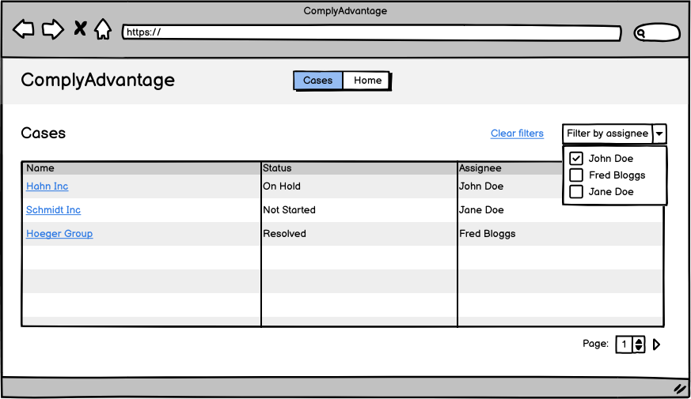

# Tech Test Instructions

Welcome to the ComplyAdvantage React tech test.

This document, in conjunction with the project `README.md` should give you the information needed to complete the test.

## Introduction

This repository has been set up to reflect the React app architecture and tooling used at ComplyAdvantage. A main app, `comply-advantage-app` is an orchestration layer that is capable of rendering components exported from "internal packages" within the repo, such as the `cases` package that has been created for you. An internal package would generally be expected to export a "top level" component containing a discrete piece of user-facing functionality.

The purpose of the `cases` package is to provide ComplyAdvantage's clients with a centralised location from which to view, review, action and manage their cases. A "case" is a potential risk that ComplyAdvantage's systems have detected when processing the client's incoming data. For example, the client could be a bank that is onboarding a new customer - "Joe Bloggs" - and has submitted an API request for ComplyAdvantage to assess whether Mr. Bloggs could pose a risk to their business. ComplyAdvantage's systems determine that Mr. Bloggs may be subject to sanctions in a number of countries. As a result, a case is created for one of the client's compliance analysts to review all the available information and make a decision about whether Mr. Bloggs represents a true risk and if further action is required.

## Task

The `cases` package exports a `CaseListView` component that is currently empty except for a heading. It is rendered when the Cases link in the `Nav` component is clicked and the app navigates to `/cases`.

Your task is to extend the `CaseListView` component to display a list of cases for the client's analysts to review. The list should be presented as a table. We've supplied a wireframe to guide you but ultimately you can style the UI in a manner of your choosing. It should be filterable by the case assignee.

As a "nice to have", clicking on a case in the cases table should navigate to a new view (with a distinct URL path) summarising the data for the individual case.

### Data

The API mocking library `msw` has been preconfigured with endpoints to provide the required data.

`/api/cases` - Returns list of cases from `packages/shared/src/mockApi/cases.ts` as part of a JSON response that also includes pagination details.

Each case has an `assignee_id`. This is the id of the user currently assigned to the case. To retrieve the name of the user a users endpoint is available:

`/api/users` - Returns list of users from `packages/shared/src/mockApi/users.ts` as JSON. The users list is relevant to the entire application and all packages it may include in the future, not just the `cases` package.

Please use the library `@tanstack/react-query` to fetch the data. A bare-bones example API request to fetch data from `/api/example` has been implemented in `apps/comply-advantage-app/src/components/App/App.tsx`.

### Implementation Guidance

- You may install and use supplementary libraries if you wish
- You may use a 3rd party component library if you wish
- A basic `theme-ui` theme is available at `apps/comply-advantage-app/src/theme/theme.ts` - it is reflective of ComplyAdvantage's internal design system.
- Some users are marked as inactive in the users response - it would be helpful if inactive assignees were identifiable as such in your cases table.
- Your implementation should be covered by tests.
